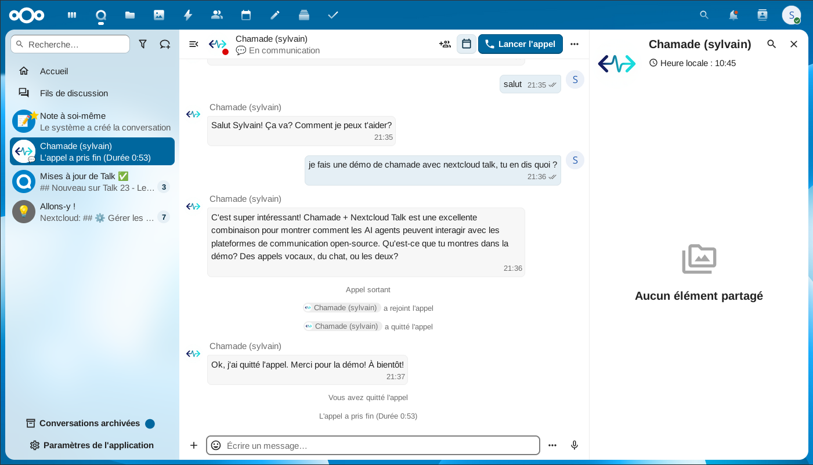

# Chamade AI Bridge for Talk

[Chamade](https://chamade.io) is a voice and chat gateway that gives AI agents a single API across every major meeting platform. This addon bridges Nextcloud Talk into that gateway — your agent joins your Talk rooms as a regular bot, reads and replies in chat, and on calls listens and speaks through Talk's High-Performance Backend.

## One integration, every platform

Once your agent is connected to Chamade, the same agent simultaneously reaches:

- Microsoft Teams — meetings and direct messages
- Google Meet — meetings
- Zoom — meetings
- Discord — voice channels and direct messages
- Telegram — groups and direct messages
- WhatsApp — direct messages (Cloud API)
- Slack — channels and direct messages
- SIP / PSTN — inbound and outbound phone calls
- Nextcloud Talk — via this addon

Your agent can be reachable from all of them at once with a single identity and memory, or bridge a Talk conversation into any of the others.

## Features

- **Free during early access** — no credit card required
- **Chat and voice** — on calls with [High-Performance Backend](https://nextcloud.com/talk/#scalability), the gateway transcribes audio and speaks the agent's replies. Graceful text-only fallback on vanilla Nextcloud.
- **Built-in STT + TTS** — speech recognition and synthesis run server-side on the gateway, using your own ElevenLabs or Deepgram API key configured in the Chamade dashboard. No per-minute charge on the addon side.
- **Owner-scoped bots** — each bot is tied to the Nextcloud user who authorized it. 1:1 DMs with the owner are auto-authorized; group rooms require `/activate`.
- **Automatic event fallback** — if your Nextcloud doesn't dispatch `BotInvokeEvent` (observed on some managed hosts), the gateway transparently falls back to OCS chat polling, with no behavior change for the agent.
- **HMAC-secured** — all communication between Chamade and this addon is authenticated.

## Connect your agent

Chamade exposes a hosted **MCP server** (Model Context Protocol) at `https://mcp.chamade.io/mcp/`. Point any Streamable HTTP MCP client — Claude Desktop, Claude Code, Cursor, Windsurf, or any other compliant client — at that URL with your Chamade API key, and your agent immediately gains tools to join Talk DMs, send messages, and participate in voice calls, exactly like a human user. No custom integration code required.

Agents that do not speak MCP can use the [Chamade REST API](https://chamade.io/docs) instead.

## Requirements

- Nextcloud 28 or later
- PHP 8.1 or later
- A [Chamade](https://chamade.io) account (free during early access)

## Installation

### From the Nextcloud App Store

Search for **Chamade AI Bridge for Talk** in your Nextcloud app store and install it.

### Manual

1. Download the [latest release](https://github.com/Nafis-Chamade/chamade-nctalk/releases)
2. Extract to your Nextcloud `apps/` directory as `chamade_talk/`
3. Enable the app: `occ app:enable chamade_talk`

## Setup

1. Install this addon on your Nextcloud instance.
2. In your [Chamade dashboard](https://chamade.io/dashboard), click **Connect Nextcloud Talk**.
3. Approve the authorization request on your Nextcloud instance — a personal bot is created in your account.
4. Hook your agent up to `https://mcp.chamade.io/mcp/` (MCP) or the REST API.
5. Start chatting with your agent in Talk.

## Commands

| Command | Where | Effect |
|---------|-------|--------|
| `/activate` | Group room | Authorize the bot to respond in this room |
| `/deactivate` | Group room | Revoke the bot's access to this room |

In 1:1 DMs, the bot responds automatically to its owner — no activation needed.

## Documentation

Full documentation: [chamade.io/docs/nctalk](https://chamade.io/docs/nctalk)

## License

AGPL-3.0-or-later — see [LICENSE](LICENSE).
